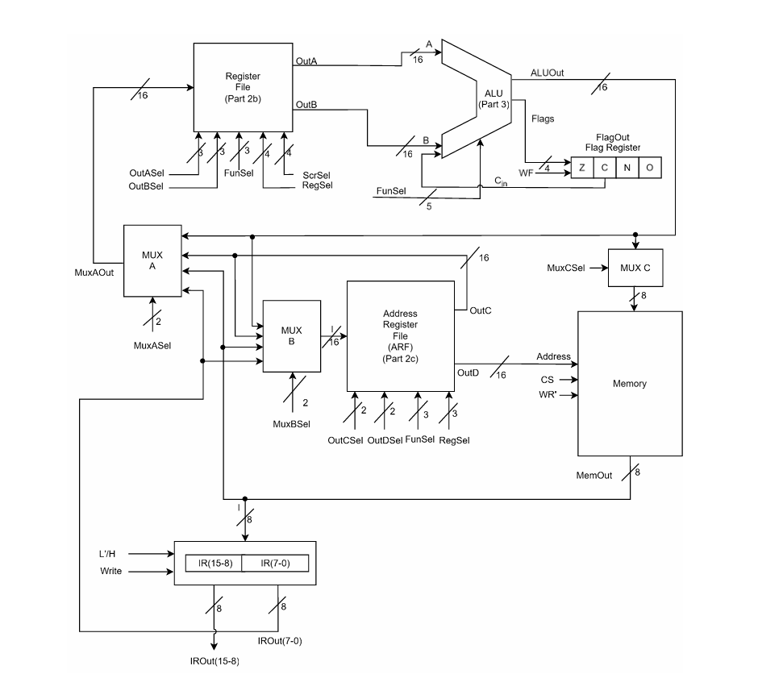

# Verilog CPU Design

A two-stage CPU design project implemented in Verilog HDL for the BLG222E Computer Organization course at Istanbul Technical University.



*Architecture diagram from the BLG222E Computer Organization project specification, included for educational and documentation purposes.*

## Overview

This repository contains the implementation of a simple 16-bit CPU developed in two consecutive projects.

### Project 1
- 16-bit Register
- Instruction Register (IR)
- Register File
- Address Register File (ARF)
- Arithmetic Logic Unit (ALU)
- Datapath Integration
- System Simulation

### Project 2
- Hardwired Control Unit
- Instruction Fetch
- Instruction Decode
- Instruction Execution
- Memory-based Program Execution
- CPU Simulation

## Technologies

- Verilog HDL
- Vivado
- Digital Logic Design
- Computer Organization

## Repository Structure

```
Project1_CPU_Components/
Project2_Control_Unit/
docs/
```

## Team

This project was developed collaboratively by:

- Zeynep Nur Yılmaz
- Nejra Gutić

as part of the BLG222E Computer Organization course.

## Notes

This repository is shared for educational and portfolio purposes.
Project specifications and some simulation files were provided as part of the course.
